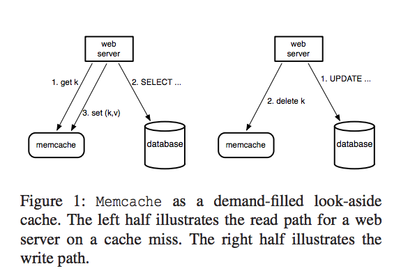
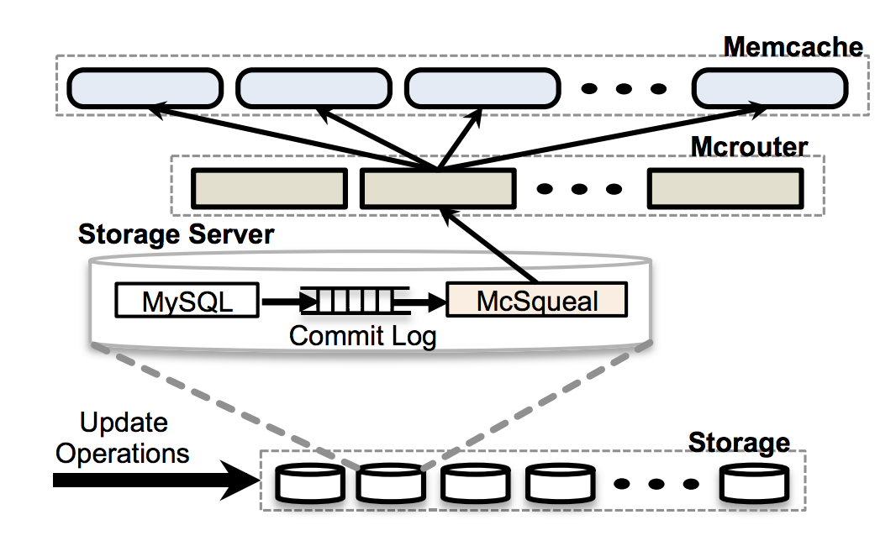

[论文阅读]Scaling Memche at Facebook

#架构
FB的Memcached服务架构包括以下几个组件：

*	Web server：接收客户端请求，其内部使用FB自己开发的MC客户端库来进行MC的访问，后面将会看到FB把相当多的优化都放在了自己实现的这个MC客户端上。后面将会简单的把Web server看成是MC客户端。
*	mrouter：FB自己开发的MC Proxy，MC客户端的请求可能经过这个代理由它转发请求给后面的MC，也可能绕过代理直接访问MC。
*	MC：FB在开源基础上做了自己的优化。

FB将一个数据中心（data center）称为一个Region，每个region中包括了以上说到的几个组件：

（上图出自论文）


#操作流程

MC读写流程如下：
```
read:
    v = get(k) (computes hash(k) to choose mc server)
    if v is nil {
      v = fetch from DB
      set(k, v)
    }
  write:
    v = new value
    send k,v to DB
    delete(k)
  application determines relationship of mc to DB
    mc doesn't know anything about DB
  FB uses mc as a "look-aside" cache
    real data is in the DB
    cached value (if any) should be same as DB
```


（上图出自论文）

需要说明的是，如上图中的右半部分，在更新数据库数据时，更新数据库完毕之后并不更新缓存，而是删除缓存数据，待客户端查询缓存miss时来请求数据库拿到最新的数据，这样做的原因在于，删除缓存操作具有幂等性。

#性能优化
当请求量上升时，直观上最简单的做法就是加更多的机器来解决．然而简单的加机器并不能解决所有的问题，请求拥塞情况会在服务器增加的情况下变的更糟糕，服务器变多了意味着客户端需要访问更多的服务器来查询数据。

下面来讨论FB为了优化集群的性能做的事情。

##将请求并行以及批量化
FB的每个页面，都会请求大量的MC数据，所以使用有向无环图（directed acyclic graph，DAG）来确定数据间的依赖关系，web服务器通过MC客户端使用这个方式来尽量确保每一次向MC请求的键值都尽可能的多。FB的统计数据表明采用DAG方式之后，平均下来每次请求24个key。遗憾的是论文中并没有针对这个机制展开来讨论具体的实现。

##优化客户端与服务器的通信机制
MC客户端的get请求，通过UDP协议与Memcached通信，由于UDP协议是无连接的，所以可以不走mrouter直接访问Memcached服务器，假如请求失败，那么客户端认为是cache miss了，但是这种情况下的cache miss并不进行查询数据之后的插入数据操作，为的是节省时间降低负载。而set和delete请求，由于涉及到数据的更改，使用的是TCP协议通过mrouter与Memcached进行通信。

##请求拥塞（incast congestion）
MC客户端采用类似TCP协议中滑动窗口算法的机制来解决incast congestion问题．即，如果一个请求应答的很快，那么窗口就会扩大，下一次该客户端就会发出更多的请求；反之窗口将会缩小，减少请求量，直到该服务器恢复．这个机制可以确保，当某一台服务器负载过大不能及时应答时，不会有更多的请求由于没有及时处理导致被积压累计．

##租约（lease）
考虑这样一个典型的问题：一个客户端更新了一个热点的数据的DB，然后按照前面的做法删除这个数据的缓存，假如在这个过程中，许多其它访问这个键值的MC客户端都miss了缓存，大家都去数据库查询数据然后set到缓存中，那么可以看到这个量是很大，其中的许多请求也是没有必要的。由于一个热点数据的缓存被删除，导致需要使用它的MC客户端都需要去查询数据库，这就是所谓的惊群问题（thundering herd）。

为了解决这个问题，FB修改了MC，加入了租约机制。租约机制会给miss该缓存的第一个MC客户端返回一个租约，在短暂的一段时间内，只有拿到租约的客户端才能去查询数据库更新缓存，而其它在这个期间没有获得租约的MC客户端，会在一段时间后重新访问这个key。

##故障处理
对于小范围的故障，依靠自动恢复系统，但是恢复过程可能有好几分钟，这几分钟可能会有其他连带的影响故障。为了缓解恢复故障过程中的压力，预留了少量被称为Gutter的机器(占集群机器总量的1%左右)，当请求超时没有应答的情况下，MC客户端访问Gutter机器并且在cache miss的情况下查询数据写到上面。

这种在某些MC服务出现故障时通过客户端智能识别出这种情况，并且将流量自动切换到备用机器的做法，与一致性Hash做法不同，不会出现一致性Hash那样由于集群服务器数量发生变化导致分布不均的情况。

在FB的实践中中，Gutter方案将客户端可以发现的故障减少了99%，如果一台memcached服务宕机，在恢复的4分钟内，Gutter机器的命中率在35%到50%之间。

##MC池
每个业务的情况不一样，导致缓存的情况也不一样，比如有的key更新的频繁，但是当miss的时候对数据库负载比较小，而有的key更新不怎么频繁，但是出现miss时去数据库的影响比较大，所以如果把所有业务都使用同一种memcached服务来处理是不合适的，针对这种情况将不同性质的key分配到不同的memcached pool中进行区分处理。

##冷集群热身（Cold Cluster Warmup）
新上线的缓存服务器，由于没有数据会导致缓存命中率极低，这就是所谓＂冷缓存＂，这种情况下会有相当多的请求穿透到后面的数据库上获取数据．此时使用另一种机制解决这个问题，即所谓的Cold Cluster Warmup（冷集群热身？），当在刚上线的冷集群的客户端向热集群（warm cluster）获取数据．但是需要注意的是，这样可能会出现读取到脏数据的情况．

#一致性
FB将数据中心（data center，也就是前面提到的region）分布在世界各地，这样做的好处是显而易见的：第一，距离客户更近的数据中心可以极大的减少延迟，第二数据中心地理位置的多元化可以缓解自然灾害和大规模电力故障的影响，第三新的位置能提供更便宜的经济成本。通过部署多个region来获得这些优势。每个region包含一个存储集群和多个前端集群。我们指定一个region持有主数据库，别的region包含只读的副本；master和slave之间依赖MySQL的复制机制来保持数据的同步。

然而这样做需要面对的就是数据的一致性问题，这些都源于一个问题：副本数据库可能滞后于主数据库。

##从主region写

在每个数据库集群的服务上，会部署名为mcsqueal的守护进程，负责监控数据库的binlog日志，每个修改数据的SQL语句中会携带在commit之后失效的memcached键列表，mcsqueal根据将失效的key广播到所有的fronted上。

为了减少请求量，mcsqueal会将多个失效请求一起打包发给每个frontend cluster 中的 mcrouter，这个批量处理使得每个TCP请求中带的key数量的中位数提升了18倍。

其实也可以使用通过在web服务上广播失效的key来通知所有的frontend cluster的做法，之所以没有这么做原因有两个：web服务器做这件事情的性能效率不如mcsqueal守护进程，毕竟是面向用户的服务，而mcsqueal的工作更单一，只需要负责这个工作；有可能会出错，而mcsqueal进程依赖的是最后的binlog日志，更加可以信赖。

但是需要看到，这个机制并不能保证在master上的修改马上同步到slave中，换言之这是一种最终一致性的数据模型。



##从非主region写
当从master上复制数据时间滞后非常大的时候，从非主region更新数据。如果它最近的改动丢失了，那么下一个请求将会导致混乱。之后当复制流完成之后才允许从副本数据库读取数据并缓存。如果没有这个保障，后续请求将会导致副本中的过时数据被读取并且缓存。 

使用远程标记（remote marker）来降低读取到过期数据的概率，具体做法如下：

*	web服务器在更新某个key k的数据时，在region中设置一个远程标记rk。
*	向master服务器发起修改请求，在SQL中带上k和rk。
*	在本集群中删除key k的缓存数据。
*	当在slave region中收到下一个关于k的请求来时，此时会发生缓存miss的情况，根据有没有这个缓存数据的远程标记rk来决定是在该region中查询数据还是到master集群中。

可以看到，这个方案牺牲了可用性来换取缓存数据的一致性。

另外需要注意的是，在针对这个数据的并发修改的情况下，一个操作可能删除远程标记，而这个标记应该为另外一个正在执行的操作保留，就可能返回过时的数据。


#单机MC服务器的性能优化
这一节主要讲FB针对MC服务器本身做了哪些优化。

*	原有的MC服务器，根据key计算hash值，将数据item以链表的形式存放到这个hash桶上。当数据量很大时，如果hash桶数量不变，那么一个hash桶上存储的数据就会越来越多，查找一个数据的时间可能会退化成一个O(N)时间复杂度的算法。FB实现hash表的自动扩容，避免查找时间复杂度退化成O(N)的情况。
* 	将原来的单线程的服务器改造为多线程，每个线程使用自己的UDP端口来应答请求。
*	实现了Adaptie Slab Allocator：Memcached根据缓存数据的大小，分了不同级别的slab。原先的MC缓存淘汰算法是当某一级的缓存不够用时，根据LRU算法淘汰掉这一级的旧数据；这个新算法的大致思想是，当发现某一级的slab使用LRU淘汰数据时，而这个被淘汰的数据其时间比至少20%的其他slab的待淘汰数据都更新，那么认为这个级别的slab需要进行调整以适应当前的情况，它的做法是将其他slab的LRU元素释放将其转移到这个slab上．
*  MC的缓存数据支持使用过期时间，MC使用的是延迟回收的机制来回收过期的缓存数据，仅当访问到这些过期的数据时才会被回收，这个算法在大多数情况下工作的很好，但是还有优化的空间。FB的优化做法是，将过期时间很短的缓存数据，同时也放在另一个链表中，每一种这样存放短期过时数据的链表根据秒来作为索引，比如下一秒过期的数据放在一个链表，下两秒过期的数据一个链表，以此类推。有了这个数据结构，每一秒首先去淘汰掉属于这一秒的超时数据，及时回收数据，而不是等待被访问到的时候才被回收。