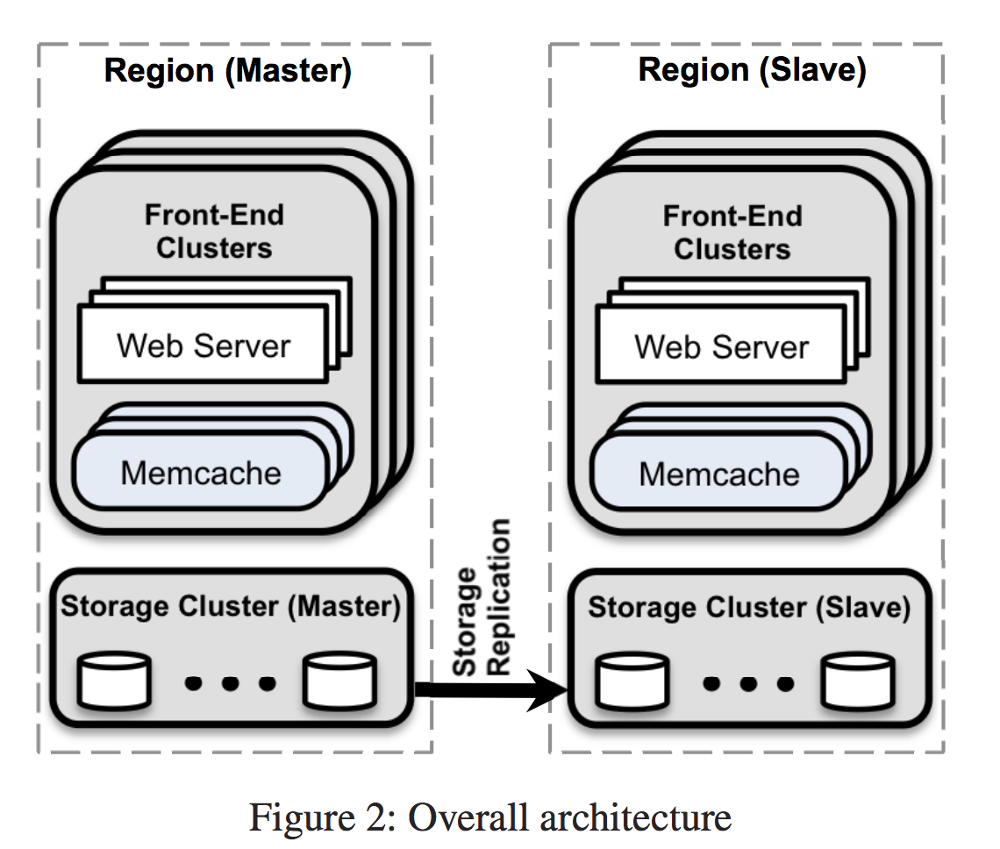

[论文阅读]Scaling Memche at Facebook

#In a Cluster: Latency and Load
##Reducing Latency
在FB，加载一个页面平均会请求521个不同的Memcached的数据，所以降低延迟变得很重要．采用了如下的措施来降低延迟：

##Parallel requests and batching
使用有向无环图（directed acyclic graph，DAG）来确定数据间的依赖关系，web服务器使用这个方式来尽量确保每一次请求的数据量都尽可能的多．FB的统计数据表明采用DAG方式之后，平均下来每次请求24个key．遗憾的是论文中并没有针对这个机制展开来讨论具体的实现．

##Client-server communication
Memcached服务器之间并不进行通讯，服务将系统的复杂性放在无状态的客户端上．FB使用的客户端组件有两种，一种是提供给web服务器使用的client库，另一种是名为mrouter的Memcached Proxy.无状态的客户端，也给快速的版本迭代提供了方便．客户端的get请求，通过UDP协议与Memcached通信，由于UDP协议是无连接的，所以可以不走mrouter直接访问Memcached服务器，假如请求失败，那么客户端认为是cache miss了，但是这种情况下的cache miss并不进行查询数据之后的插入数据操作，为的是节省时间降低负载．而set和delete请求，由于涉及到数据的更改，使用的是TCP协议通过mrouter与Memcached进行通信．
##incast congestion
客户端采用类似TCP协议中滑动窗口算法的机制来解决incast congestion问题．即，如果一个请求应答的很快，那么窗口就会扩大，下一次该客户端就会发出更多的请求；反之窗口将会缩小，减少请求量，直到该服务器恢复．这个机制可以确保，当某一台服务器负载过大不能及时应答时，不会有更多的请求由于没有及时处理导致被积压累计．

#Reducing Load

##lease
引进租约机制是为了解决两类很典型的问题：

	*	stale set：是指在Query cache和Update cache并发执行的时候，向缓存写入不是最新的数据数据．
	*	惊群（thundering herd）问题，这个问题当某一个缓存key被频繁读写时出现，此时读操作频繁地miss导致频繁地访问数据库．

租约机制如何解决以上两个问题：

	*	当客户端查询到一个cache miss时，memcached服务器会提供给这个客户端一个64bit的lease token，下次有客户端需要重新set这个miss的cache key数据，需要带上这个返回的token，这样memcached服务就能区分出来哪些客户端是可以写入数据的，不带token的客户端将不被允许写入数据．
	* 	在此基础上，memcached服务器通过一个分配每个key的lease token时间间隔，来降低返回token的频率，通常这个时间间隔为10妙．在这个时间内的请求，如果不能取得token，那么memcached将通知该客户端等待一下稍后重试，如此来限制同一时间里只有一个客户端能
	*  通过使用lease机制，将原来峰值期间数据库的请求量从17k/s，降低到了1.3k/s．

##Memcache Pools
每个业务的情况不一样，导致缓存的情况也不一样，比如有的key更新的频繁，但是当miss的时候对数据库负载比较小，而有的key更新不怎么频繁，但是出现miss时去数据库的影响比较大，所以如果把所有业务都使用同一种memcached服务来处理是不合适的，针对这种情况将不同性质的key分配到不同的memcached pool中进行区分处理．

##Handling Failures

有两种必须处理的故障：

*	一小部分的主机因为网络或者服务器的故障导致不可访问
* 	一个集群内相当数量的服务宕机．

对于小范围的故障，依靠自动恢复系统，但是恢复过程可能有好几分钟，这几分钟可能会有其他连带的影响故障．为了缓解恢复故障过程中的压力，预留了少量被称为Gutter的机器(占集群机器总量的1%左右)，当请求超时没有应答的情况下，客户端访问Gutter机器并且在cache miss的情况下将查询数据写到上面．

某些memcached服务出现故障时通过客户端智能识别出这种情况，并且将流量自动切换到备用机器的做法，与一致性Hash做法不同，不会出现一致性Hash那样由于集群服务器数量发生变化导致分布不均的情况．

在实战中，Gutter方案将客户端可以发现的故障减少了99%，如果一台memcached服务宕机，在恢复的4分钟内，Gutter机器的命中率在35%到50%之间．

#In a Region: Replication
当请求量上升时，直观上最简单的做法就是加更多的机器来解决．然而简单的加机器并不能解决所有的问题，请求拥塞情况也会在服务器增加的情况下变的更糟糕．FB将web服务和memcached服务分隔为不同的fronted　clusters，这些fronted以及其后的数据库存储被称为一个region，不同的fronted之间可能会共享同样的数据库．

(图片出自论文)

##Regional Invalidations

*	由于多个fronted后面可能跟着同一个数据库集群，所以每当出现数据库修改时，需要保证在尽量短的时间内，其他fronted上的memcached能够拿到最新的数据．
* 	在每个数据库集群的服务上，会部署名为mcsqueal的守护进程，负责监控数据库的binlog日志，每个修改数据的SQL语句中会携带在commit之后失效的memcached键列表，mcsqueal根据将失效的key广播到所有的fronted上．
*  为了减少请求量，mcsqueal会将多个失效请求一起打包发给每个frontend cluster 中的 mcrouter，这个批量处理使得每个TCP请求中带的key数量的中位数提升了１８倍．
*  其实也可以使用通过在web服务上广播失效的key来通知所有的frontend cluster的做法，之所以没有这么做原因有两个：web服务器做这件事情的性能效率不如mcsqueal守护进程，毕竟是面向用户的服务，而mcsqueal的工作更单一；可能会出错，而mcsqueal进程依赖的是最后的binlog日志，更加可以信赖．

##Regional Pools

##Cold Cluster Warmup
新上线的缓存服务器，由于没有数据会导致缓存命中率极低，这就是所谓＂冷缓存＂，这种情况下会有相当多的请求穿透到后面的数据库上获取数据．此时使用另一种机制解决这个问题，即所谓的Cold Cluster Warmup（冷集群热身？），当在刚上线的冷集群的客户端向热集群（warm cluster）获取数据．但是需要注意的是，这样可能会出现读取到脏数据的情况．

##Across Regions: Consistency
FB将数据中心分布在世界各地，这样做的好处是显而易见的：第一，距离客户更近的数据中心可以极大的减少延迟，第二数据中心地理位置的多元化可以缓解自然灾害和大规模电力故障的影响，第三新的位置能提供更便宜的经济成本．通过部署多个region来获得这些优势。每个region包含一个存储集群和多个前端集群。我们指定一个region持有主数据库，别的region包含只读的副本；我们依赖MySQL的复制机制来保持副本数据库与主数据库的同步．

然而这样做需要面对的就是数据的一致性问题，这些都源于一个问题：副本数据库可能滞后于主数据库．

###从主region写
由主region来负责数据的修改以及广播通知其他region该数据已经被更新，就是前面提到的mcsqueal守护进程的方式．

###从非主region写
使用远程标记（remote marker）来降低读取到过期数据的概率，具体做法如下：

*	web服务器在更新某个key k的数据时，在region中设置一个远程标记rk.
* 	向master服务器发起修改请求，在SQL中带上k和rk
*  在本集群中删除key k的缓存数据．

当下一个关于k的请求来时，此时会发生缓存miss的情况，根据有没有这个缓存数据的远程标记rk来决定是在该region中查询数据还是到master集群中．

可以看到，这个方案牺牲了可用性来换取缓存数据的一致性．

另外需要注意的是，在针对这个数据的并发修改的情况下，一个操作可能删除远程标记，而这个标记应该为另外一个正在执行的操作保留，就可能返回过时的数据．

#Single Server Improvements
这一节主要讲FB针对memcached服务器本身做了哪些优化．

*	实现hash表的自动扩容，避免查找时间复杂度变成O(N)的情况．
* 	将原来的单线程的服务器改造为多线程．
*  每个线程使用自己的UDP端口来应答．
*  实现了Adaptie Slab Allocator：Memcached根据缓存数据的大小，分了不同级别的slab．原先的memcached缓存淘汰算法是当某一级的缓存不够用时，根据LRU算法淘汰掉这一级的旧数据；这个新算法的大致思想是，当发现某一级的slab使用LRU淘汰数据时，而这个被淘汰的数据其时间比至少20%的其他slab的待淘汰数据都更新，那么认为这个级别的slab需要进行调整以适应当前的情况，它的做法是将其他slab的LRU元素释放将其转移到这个slab上．
*  Memcache的缓存数据支持使用过期时间，Memcache使用的是延迟回收的机制来回收过期的缓存数据，也就是仅当访问到这些过期的数据时才会被回收，这个算法在大多数情况下工作的很好，但是还有优化的空间．FB的优化做法是，将过期时间很短的缓存数据，同时也放在另一个链表中，每一种这样存放短期过时数据的链表根据秒来作为索引．有了这个数据结构，每一秒首先去淘汰掉属于这一秒的超时数据，而不是等待被访问到的时候才被回收．
