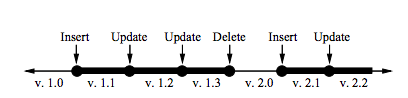
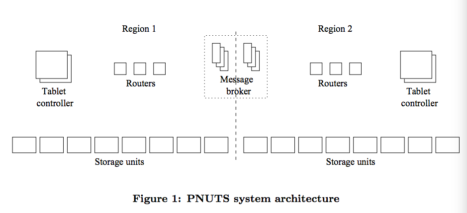
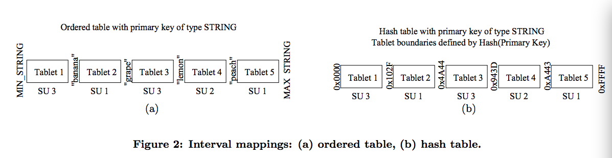

#一致性模型
PNUTS对每条记录都加上版本号，规则如下：

*   每次新插入数据时会生成递增一个大版本号。
*   每次更新（包括删除）已经存在的数据递增一个小版本号。

使用记录的版本号，PNUTS提供了如下几种API：

##Read-any
系统可能返回任意版本的数据，这里就有可能有过期的数据。然而对很多业务而言，一致性的要求并不那么强，降低一致性带来的就是可用性的提高。

##Read-critical(required version)
返回一个参数要求的版本号的数据。这种API面向那些在写入数据成功之后，需要立即看到这次写入对应结果的业务。

##Read-latest
读到最新的数据，这个API的一致性要求是最高的，相应的可用性就不如前两个API。

##Write
提供了ACID的保证，这个API用于比如用户更新资料的场景。

##Test-and-set-write(required version)
类似于CAS功能，即只有在当前数据满足对应版本号时才进行数据的写入。

#架构
PNUTS的每个数据中心称为一个region，其中包括如下几个组件：

*   storage unit:存储单元。PNUTS上存储数据的基本单位是tablet，一个storage unit上有多个tablet，每个tablet可能有几百M或者几G的大小，包含千到万级别的记录。tablet可能有两种类型的table，一种是hash表，基于一般的unix文件系统实现；另一种是有序表（ordered table），基于Mysql的Innodb引擎实现，因为这种存储引擎基于主键进行排序。
*   router：router相当于region的门户，要查找一个数据在哪个storage unit上存储，首先要经过router。router查询数据的规则，根据不同类型的表有所区别，如下图所示，如果是有序表，将主键分为不同的区间，router存储了不同区间所在的tablet；而对于hash表，首先将计算查找key的hash值，将这个hash值映射到范围[0,2^n）之间，同样的此时router也只需要存储每个区间所在的tablet即可。
*   tablet controller：上面提到的router存放的键到区间的映射关系只是一份临时数据，而router需要定期的向这里的tablet controller拉取最新的映射数据。如果router上的数据是过期的，那么可能请求会被定向到错误的tablet上，此时会返回一个错误，这样也驱动router到tablet controller上获取最新的映射关系数据。这里也可以看到，这样的设计中，router是状态很轻的服务，及时宕机重新启动一个拉取最新的映射关系即可，并不会造成太大影响。通常tablet controller会在一个集群中存在两份，但是不会成为系统的瓶颈，因为这个组件并不在关键的请求路径上。
*   message broker：一个用于PUB/SUB发布订阅消息的组件，用于同步数据，后面会详细谈到这个组件。

#备份与一致性

