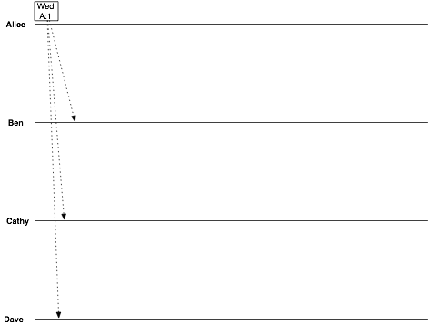
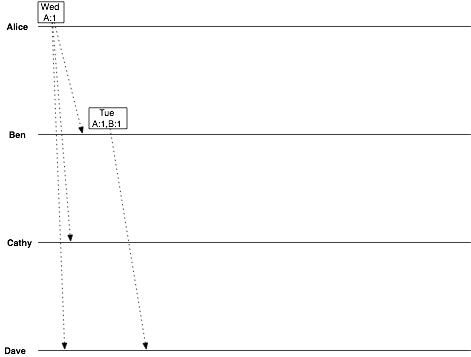
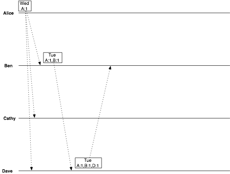
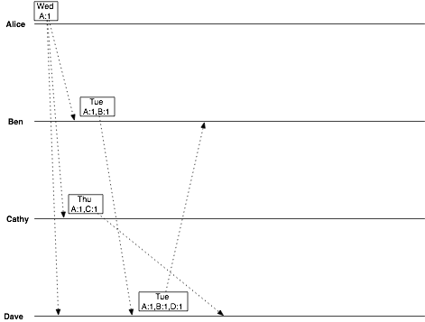
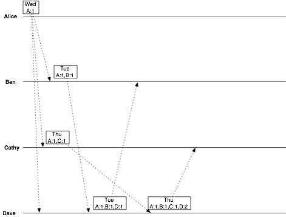
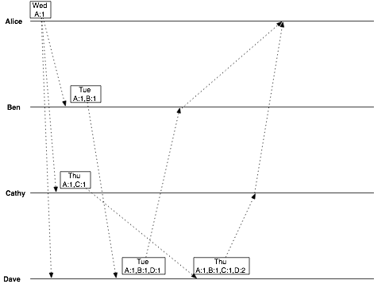
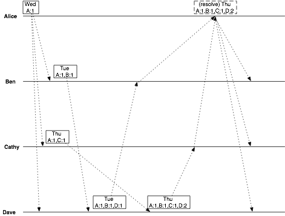

最近开始在看dynamo论文，这篇论文是分布式领域的经典论文，里面涉及了好几个分布式相关的技术，所以决定分开来讨论里面涉及到的知识。

今天先谈的是时钟向量（Vector Clock）。

#全局时钟的弊端
涉及到分布式系统上多份数据的一致性问题时，经常采用的一个策略就是时间戳，但是这个理论的基础是建立在全局时钟的前提下的，即认为所有系统中的进程，它们的时间都是一样的。

显然这个理论基础有弊端：

1.  全局时钟同步的代价极大。
2.  需要考虑进程间通信的时间。比如一个两个进程A、B，A在全局时钟的时间a修改了数据，B在全局时钟的时间a+1也修改了时间，但是进程A将自己的修改同步到进程B时在通信上消耗了2时间单位，那么在接收到修改的进程B看来，自己是在进程A之前进行的修改。

#逻辑时钟
于是，物理上的时间不那么可靠，就提出了逻辑时钟的概念。这个概念又是由Leslie Lamport提出的，它的目的就是为了解决前面全局时钟的问题，探讨在不依赖于全局物理时钟的情况下如何确定在系统中各个事件的发生次序（文中称为happen-before），并且基于这些得到不同进程之间事件发生的次序关系。

它首先定义了什么叫“happen-before”的关系，这是一种偏序关系（Partial Ordering），用符号“->”来表示如下：

1.  在同一个进程中，如果事件a发生的时间早于事件b，那么a -> b；
2.  在不同的两个进程A、B中，如果事件a表示进程A发了一条消息给进程B，事件b表示进程B收到了这条消息，那么 a -> b；
3.  如果有这样的关系，a -> b， b -> c，那么a -> c。即偏序关系存在着传递性。

显然，从上面可以看出happen-before，定义的时间之间的一个因果（casual）关系。

两个事件a、b被认为是并发（concurrent）的，只有在满足(not (a -> b) and not (b -> a)）的条件下，即不能确定谁先谁后的情况下。

如下图中所示：


从前面的理论中可以看出：

1.  p1 -> r4。这是因为p1 -> q2,q4 -> r3，而q2 -> q4,r3 -> r4，由传递关系可以得到p1->r4。
2.  p3与q3是并发的，因为不能从图中推导出任何p3与q3的偏序关系。

此时可以定义逻辑时钟了。论文中使用了一个函数C，作为每个进程用来计算每个事件的时间。比如Ci(a)用来表示进程Pi的事件a的逻辑时间。

为了满足逻辑时钟，需要满足以下两个条件：

1.  对于单个进程 Pi, 如果事件a发生时间早于b, 那么 Ci (a) < Ci (b)。
2.  对于在不同进程的情况, 如果进程Pi发送消息到进程Pj为事件a，进程Pj接收到消息作为事件b, 那么 Ci (a) < Ci (b)。

为了满足条件1，只需要在单个进程中递增时间即可。

为了满足条件2，需要在跨进程发消息的时候带上C传递给接收进程。比如在前面的例子中，就是要 Pi在事件a中附带上自己的Ci传递给进程Pj, 然后进程Pj 要递增到 max (Ci, Cj) + 1。

可以看到，“逻辑时钟”中里面存放的数据，更多的是类似递增版本号的数据。

#时钟向量
终于到这一期的重点时钟向量了。

时钟向量中，每个进程都有一个向量，用于保存系统中所有进程（包括本进程）当前的版本号。如下面的表格表示的这样：

进程        | P0| P1 | P2
------------- |----- |--|--:
P0 |4|2|2
P1|1|4|0
P2|2|1|1

如下3个规则来维护时钟向量：

1.  每个进程都负责维护本进程的一个版本号，当有数据发生修改时，版本号递增1。
2.  进程与其他进程进行通信时，与消息m一起带上进程此时的时钟向量VC，记做m.VC，用于表示消息m的进程向量。
3.  进程Pj在收到消息m时，将本进程的时钟向量，置为max（本进程时钟向量，m.VC）。也就是取这两个时钟向量对应维度的最大值。

现在，有了时钟向量之后，每个进程都有了当前系统中所有进程的版本号，以下面这个关系来判断不同进程之间版本的因果关系：

```
对于系统中的进程Pi,Pj，如果Pi进程中时钟向量的各个维度的版本号，都小于进程Pj中对应维度的版本号，那么进程Pi是进程Pj的因。
```
比如在前面的例子中，进程P2所有维度的版本号都小于对应维度上进程P0的版本号，所以进程P2上维护的状态数据是进程P0的因。


#应用
以一个例子来说明如何使用时钟向量，来维护一个分布式系统的一致性。

Alice, Ben, Cathy, Dave四个人准备下周聚餐，在时间安排上协调出现了问题。

首先，Alice提出Wednesday聚餐，那么对提出这个提议的Alice来说，此时她的时钟向量就是这样的：

```
date = Wednesday
vclock = Alice:1
```

她将这个消息广播给其他三个人：



Ben在收到提议之后，提出自己的提议Tuesday，此时ben的时钟向量就是：

```
date = Tuesday
vclock = Alice:1, Ben:1
```

ben将自己的时钟向量广播给dave：



dave收到之后，应答ben表示同意ben的提议，此时dave的时钟向量是：

```
date = Tuesday
vclock = Alice:1, Ben:1, Dave:1
```



Cathy此时也终于有了应答，她在alice的基础上提出Thursday，此时她看到的是这样的：

```
date = Thursday
vclock = Alice:1, Cathy:1
```



收到cathy广播的dave表示懵逼了，因为此时他看到的是两份有冲突的数据：

```
date = Tuesday
vclock = Alice:1, Ben:1, Dave:1
```

以及

```
date = Thursday
vclock = Alice:1, Cathy:1
```

可以看到，这两份数据中，谁都不是谁的因，因此dave自己决定做一个数据的合并，生成了一份新的数据：

```
date = Thursday
vclock = Alice:1, Ben:1, Cathy:1, Dave:2
```

注意到在这里，除了数据合并之外，dave的版本号递增了1。

dave将这个合并之后的数据，返回给了cathy：



于是alice可以收到来自ben的应答：

```
date = Tuesday
vclock = Alice:1, Ben:1, Dave:1
```

以及来自cathy的应答：

```
date = Thursday
vclock = Alice:1, Ben:1, Cathy:1, Dave:2
```



可以看出来，后者的版本号大于前者，因此前者是因后者是果。这样合并数据就很简单了。




