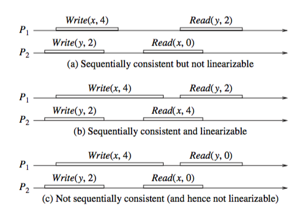

今天讨论几种一致性模型，实现这几种一致性模型的难度依次递减，对一致性的要求强度也依次递减。

为了讨论的方便，下面先规定一下两个有关读写的表示法：

1.  Write(y,a)表示向变量y写入数据a；
2.  Read(x,b)表示从变量x读出数据b；

#强一致性
所谓的强一致性（strict consistency）,也称为原子一致性（atomic consistency）或者线性（Linearizability）。

它对一致性的要求两个：

1.  任何一次读都能读到某个数据的最近一次写的数据。
2.  系统中的所有进程，看到的操作顺序，都和全局时钟下的顺序一致。

显然这两个条件都对全局时钟有非常高的要求。

强一致性，只是存在理论中的一致性模型，比它要求更弱一些的，就是顺序一致性。

#顺序一致性
顺序一致性（Sequential Consistency），也同样有两个条件，其一与前面强一致性的要求一样，也是可以马上读到最近写入的数据，然而它的第二个条件就弱化了很多，它允许系统中的所有进程形成自己合理的统一的一致性，不需要与全局时钟下的顺序都一致。

这里的第二个条件的要点在于：

1.  系统的所有进程的顺序一致，而且是合理的，就是说任何一个进程中，这个进程对同一个变量的读写顺序要保持，然后大家形成一致。
2.  不需要与全局时钟下的顺序一致。

可见，顺序一致性在顺序要求上并没有那么严格，它只要求系统中的所有进程达成自己认为的一致就可以了，即错的话一起错，对的话一起对，同时不违反程序的顺序即可，并不需要个全局顺序保持一致。

以下面的图来看看这两种一致性的对比：

（出自《分布式计算-原理、算法与系统》）

1.  图a是满足顺序一致性，但是不满足强一致性的。原因在于，从全局时钟的观点来看，P2进程对变量X的读操作在P1进程对变量X的写操作之后，然而读出来的却是旧的数据。但是这个图却是满足顺序一致性的，因为两个进程P1,P2的一致性并没有冲突。从这两个进程的角度来看，顺序应该是这样的：Write(y,2) , Read(x,0) , Write(x,4), Read(y,2)，每个进程内部的读写顺序都是合理的，但是显然这个顺序与全局时钟下看到的顺序并不一样。
2.  图b满足强一致性，因为每个读操作都读到了该变量的最新写的结果，同时两个进程看到的操作顺序与全局时钟的顺序一样，都是Write(y,2) , Read(x,4) , Write(x,4), Read(y,2)。
3.  图c不满足顺序一致性，当然也就不满足强一致性了。因为从进程P1的角度看，它对变量Y的读操作返回了结果0。那么就是说，P1进程的对变量Y的读操作在P2进程对变量Y的写操作之前，这意味着它认为的顺序是这样的：write(x,4) , Read(y,0) , Write(y,2), Read(x,0)，显然这个顺序又是不能被满足的，因为最后一个对变量x的读操作读出来也是旧的数据。因此这个顺序是有冲突的，不满足顺序一致性。

#因果一致性
因果一致性（Casual Consistency）在一致性的要求上，又比顺序一致性降低了：它仅要求有因果关系的操作顺序得到保证，非因果关系的操作顺序则无所谓。

因果相关的要求是这样的：

1.  本地顺序：本进程中，事件执行的顺序即为本地因果顺序。
2.  异地顺序：如果读操作返回的是写操作的值，那么该写操作在顺序上一定在读操作之前。
3.  闭包传递：和时钟向量里面定义的一样，如果a->b，b->c，那么肯定也有a->c。

以下面的图来看看这两种一致性的对比：

（出自《分布式计算-原理、算法与系统》）

1.  图a满足顺序一致性，因此也满足因果一致性，因为从这个系统中的四个进程的角度看，它们都有相同的顺序也有相同的因果关系。
2.  图b满足因果一致性但是不满足顺序一致性，这是因为从进程P3、P4看来，进程P1、P2上的操作因果有序，因为P1、P2上的写操作不存在因果关系，所以它们可以任意执行。不满足一致性的原因，同上面一样是可以推导出冲突的情况来。

#腾讯朋友圈的例子
在infoq分享的腾讯朋友圈的设计中，他们在设计数据一致性的时候，使用了因果一致性这个模型。用于保证对同一条朋友圈的回复的一致性，比如这样的情况：

1.  A发了朋友圈内容为梅里雪山的图片。
2.  B针对内容a回复了评论：“这里是哪里？”
3.  C针对B的评论进行了回复：”这里是梅里雪山“。

那么，这条朋友圈的显示中，显然C针对B的评论，应该在B的评论之后，这是一个因果关系，而其他没有因果关系的数据，可以允许不一致。

微信的做法是：

1.  每个数据中心，都自己生成唯一的、递增的数据ID，确保能排重。在下图的示例中，有三个数据中心，数据中心1生成的数据ID模1为0，数据中心1生成的数据ID模2为0，数据中心1生成的数据ID模3为0，这样保证了三个数据中心的数据ID不会重复全局唯一。
2.  每条评论都比本地看到所有全局ID大，这样来确保因果关系，这部分的原理前面提到的向量时钟一样。

有了这个模型和原理，就很好处理前面针对评论的评论的顺序问题了。

1.  假设B在数据中心1上，上面的ID都满足模1为0，那么当B看到A的朋友圈时，发表了评论，此时给这个评论分配的ID是1，因此B的时钟向量数据是[1]。
2.  假设C在数据中心2上，上面的ID都满足模2为0，当C看到了B的评论时，针对这个评论做了评论，此时需要给这个评论分配的ID肯定要满足模2为0以及大于1，评论完毕之后C上面的时钟向量是[1,2]。
3.  假设A在数据中心3上，上面的ID都满足模3为0，当A看到B、C给自己的评论时，很容易按照ID进行排序和合并--即使A在收到C的数据[1,2]之后再收到B的数据[1]，也能顺利的完成合并。

#参考资料
微信朋友圈技术之道 http://www.infoq.com/cn/presentations/technology-of-weixin-moments

《分布式计算-原理、算法与系统》

《分布式系统一致性的发展历史 (一)》

