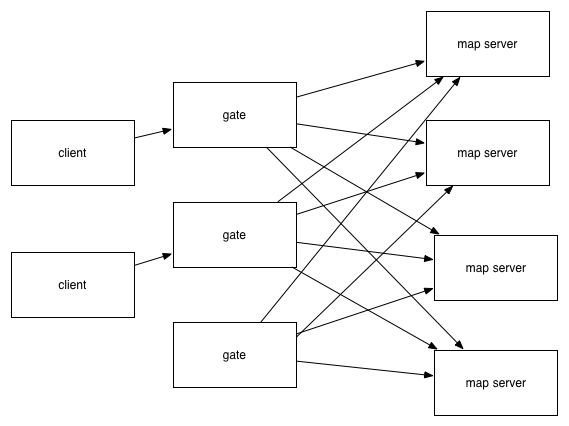
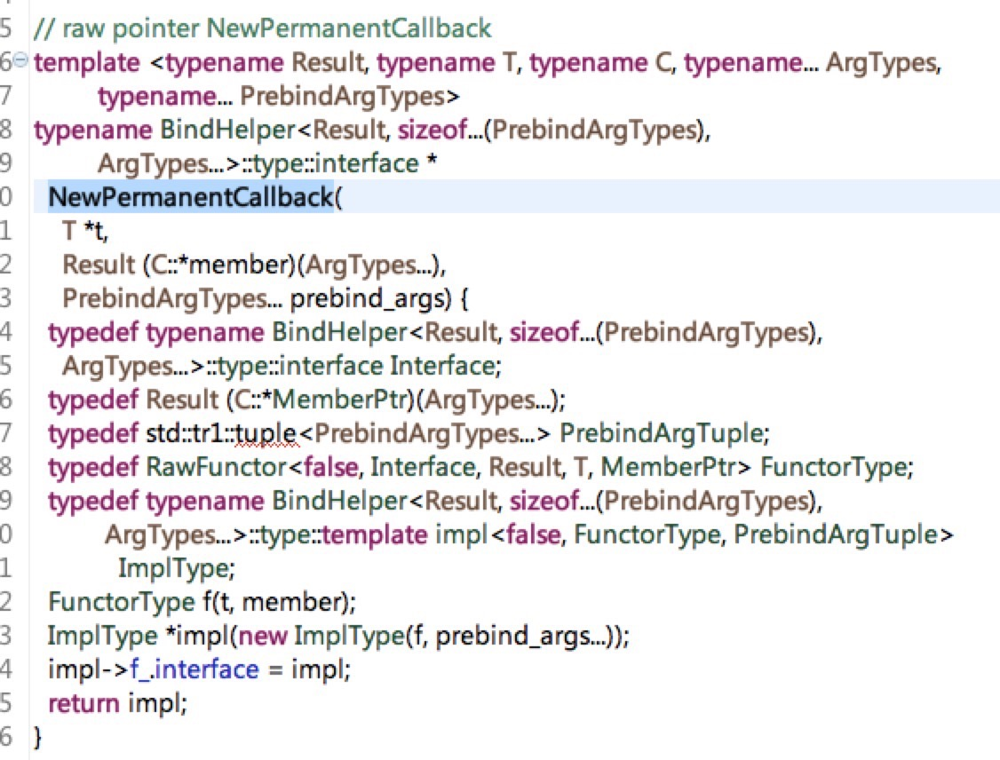

#分布式网游服务器架构中的对象管理
这几天整理以前做大型网游开发时的架构，我们当时开发的游戏是类似LOL这样的游戏，即提供一个开房间的服务，想玩游戏的玩家，按照某些匹配算法，匹配到当前也想玩游戏的玩家，然后一起到某个开好的房间里面进行游戏。

服务器端的架构大体如下：



在上图中，包括几个组件：

1.  gate：网关服务器，用于转发客户端请求到对应的业务服务器上。一般而言，网游服务器的设计上，对外而言仅暴露gate服务（顶多就是再多一个登录服务）。这样的好处是，随着业务增加，服务的类型可能会不停的增加，但是并不希望这些都让客户端感知到，所以后面的服务如何扩充，都只需要与网关服务通信就好了。另外网关服务还可以提供类似组播（multicast）的功能，考虑这样一个场景：一个玩家说了一句话，需要在这个场景范围内的玩家都看到，此时gate需要根据条件自己来查找满足条件的用户来进行广播。gate是无状态的，与客户端之间保持长连接，系统中可以部署多个gate服务。

2.  map server：实际的游戏逻辑，主要在这类服务器中进行。

当然，在这里简化了很多，实际上的架构比这个复杂的多。

这里不是想针对这个架构做太多的讨论，想要更多了解游戏服务的设计，可以参考一下《游戏服务端究竟解决了什么问题？》和《游戏服务端架构发展史》。

在这里主要讨论一下当时设计到这部分时的一个主要的组件，其作用是分布式对象的管理和通信的，内部称为DOM（distribute object manager）。

之所以要引入这个组件，是希望给系统加一层抽象：使用者可以使用这个组件，方便的进行消息的通信，而不需要关心对象的地址、出错处理等。

比如场景A的用户a，需要向场景B的用户b说话，那么作为使用者，它应该是不需要关心这个对象具体在哪里的，而只需要提供：

1.  聊天对象的用户id。
2.  具体的消息内容。

再比如，场景A的用户a，从场景A移动到了场景B，这两个场景不在同一个map server上进行维护，此时需要一个传输操作，将这个用户切换场景，而这个过程对其他用户而言也是透明的，当再次需要与这个用户通信时，这个组件自己负责这个用户的重新定位。

以上是对这个组件使用场景的一些说明，为了实现这些，系统里面提供了两个组件：

1.  lock service：lock service：内部使用的一个服务，可以通过它针对某个key进行读写锁等操作。以下简称ls。
2.  DOM：前面提到的DOM，其实是一个库，每个服务器都可以使用这个库来进行消息的通信。其内部实现上，实际上使用的就是第一点中提到的lock service的客户端与lock service进行通信。有了这个库，服务器开发者完全对这套分布式的逻辑透明，只需要调用相应的函数来进行操作即可。

ls提供以下几种服务：

1.  读、写操作：根据key进行读、写的操作。
2.  锁、解锁操作：根据key进行锁、解锁操作。
3.  删除操作：根据key进行删除操作。

具体的实现上，ls针对每个key对象维护一个结构体，结构体中存有一个token，客户端的请求上来时，唯有token匹配上的客户端才能继续操作，否则就加入等待队列中，当前操作完成之后从等待队列中取出等待的操作进行处理，如果此时该操作的key上没有被分配的token，说明没有别的操作，就分配一个可用的token进行操作；否则如果仍然不满足条件就重新进入等待队列继续等待被唤醒。同时，每个操作有一个最长等待时间，程序中会定时检查，将已经超时的请求应答客户端超时了。

DOM使用ls的客户端，提供以下几种服务：

1.  transfer操作：将某个key的数据传输到另一个key上。
2.  send操作：根据key向这个key发消息。
3.  根据key进行读、写、删除操作。

DOM由于是一个提供给内部服务器的库，实现时有以下的细节：

1.  针对每个key维护一个消息通道，比如有服务器A、B，A会维持一条到B上的长连接，假如A上的DOM已经知道key a是在服务器B上的，那么所有发给key a的消息都通过这个长连接进行发送，其中的错误处理等都是底层的网络库负责的，应用程序使用DOM发消息等操作时传入一个回调函数，当操作完成回调之，通过错误码识别结果。
2.  除了消息通道之外，每个key还有一个消息队列，这里可以做流控、重传等。
3.  DOM会缓存已经知道的key的位置，具体的做法是，每个key注册的时候会调用ls的写操作把自己所在的服务器地址写下来，而其他的使用DOM的服务要知道这个key在哪里可以去ls针对这个key进行读操作。如果这个key发生了前面的transfer操作，比如从服务器A到了服务器B，那么发到服务器A的请求将会返回key已经不在这个服务器的错误码，当DOM发现是这个错误时会重新到ls上读一次新的数据。这个机制避免了每次都去请求ls，使它成为系统的瓶颈。
4.  DOM上面还提供了每个key的注册，以及这个key处理的消息类型的处理器函数的注册。如果一个消息发过来，不是这个key能处理的，也是直接报错返回了。

下面提一下，DOM怎么根据ls提供的服务语义，来实现transfer操作：

1.  DOM向ls发起一个lock操作。
2.  lock成功之后，向新的目标服务器发起一个写操作，要求将这个key修改到这个服务器上，这里同时也会修改ls上这个key对应的信息，以便后面可以寻址到这个key的位置。
3.  写操作成功之后，解锁第一步加的锁。

从上面的描述来看，不管是系统中的某个服务，还是具体的玩家，在这个系统看来都是一个分布式对象，在DOM看来这些对象的特点是：

1.  有唯一对应的key。
2.  有注册的可以处理的消息类型。

有了这两个数据，在整个大的系统中，理论上可以针对任何管理到的分布式对象进行消息通信了。

熟悉Erlang的朋友，一定觉得这个模型和Erlang太相近了，我当时弄明白这个设计也是这么认为的。在Erlang的微进程模型中，根据进程的pid来发消息，而进程的消息处理器中，根据pattern来匹配处理收到的消息。每个进程内部，也是使用类似邮箱的机制来缓存收到的各种消息。

下面是我认为实现的还不够好的地方。

首先，ls的数据是存在内存中的，好像后面做了修改，可以同时更新到磁盘上。但是这个服务貌似是单点的，整个系统中只有一个ls的服务，没有使用类似Paxos之类的一致性算法来同步多个ls之间的数据。我不知道后来怎么处理这个问题，可能是如果ls重启的话，每个DOM客户端重新上报一下自己当前的数据信息吧。对比起来，Erlang的分布式集群管理，高了不知道多少。

其次，具体的代码中，用到一些炫技的地方，比如下面的这段C++代码：



它的原意是根据模板生成处理某类消息的回调函数，这样在接收到消息之后可以根据消息来匹配查找对应的处理函数，我的C++功力实在不足以让我把控住这样的代码。个人认为，完全可以定义一个消息的基类，基类中有消息的类型和虚函数进行消息的处理，给每一类消息定义一个消息类型的ID，收到消息之后首先根据这个ID来查找当前这个key已经注册的消息表，简单高效可维护性强。

```C++
class Message {
    int type_;
    virtual int Handle() = 0;

    Message(int type) : type_(type) {

    }
    virtual ~Message();
}
```


