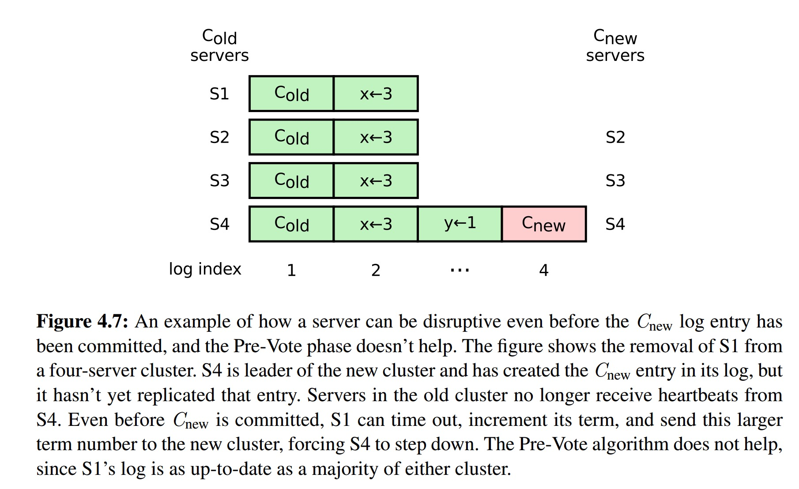

Raft论文阅读笔记

论文 [CONSENSUS: BRIDGING THEORY AND PRACTICE](https://ramcloud.stanford.edu/~ongaro/thesis.pdf) 阅读笔记

#基本算法
## server数据状态及通信RPC

注：这一小节拷贝自 [maemual/raft-zh_cn](https://raw.githubusercontent.com/maemual/raft-zh_cn/master/raft-zh_cn.md)

**状态**：

|状态|所有服务器上持久存在的|
|-------|------|
|currentTerm | 服务器最后一次知道的任期号（初始化为 0，持续递增）|
|votedFor | 在当前获得选票的候选人的 Id|
| log[] | 日志条目集；每一个条目包含一个用户状态机执行的指令，和收到时的任期号 |

|状态|所有服务器上经常变的|
|-------|------|
| commitIndex| 已知的最大的已经被提交的日志条目的索引值|
| lastApplied| 最后被应用到状态机的日志条目索引值（初始化为 0，持续递增）|

| 状态 | 在领导人里经常改变的 （选举后重新初始化）|
|----|--------|
| nextIndex[] | 对于每一个服务器，需要发送给他的下一个日志条目的索引值（初始化为领导人最后索引值加一）|
| matchIndex[] | 对于每一个服务器，已经复制给他的日志的最高索引值|


**附加日志 RPC**：

由领导人负责调用来复制日志指令；也会用作heartbeat

| 参数 | 解释 |
|----|----|
|term| 领导人的任期号|
|leaderId| 领导人的 Id，以便于跟随者重定向请求|
|prevLogIndex|新的日志条目紧随之前的索引值|
|prevLogTerm|prevLogIndex 条目的任期号|
|entries[]|准备存储的日志条目（表示心跳时为空；一次性发送多个是为了提高效率）
|leaderCommit|领导人已经提交的日志的索引值|

| 返回值| 解释|
|---|---|
|term|当前的任期号，用于领导人去更新自己|
|success|跟随者包含了匹配上 prevLogIndex 和 prevLogTerm 的日志时为真|

接收者实现：

1. 如果 `term < currentTerm` 就返回 false
2. 如果日志在 prevLogIndex 位置处的日志条目的任期号和 prevLogTerm 不匹配，则返回 false
3. 如果已经存在的日志条目和新的产生冲突（索引值相同但是任期号不同），删除这一条和之后所有的
4. 附加任何在已有的日志中不存在的条目
5. 如果 `leaderCommit > commitIndex`，令 commitIndex 等于 leaderCommit 和 新日志条目索引值中较小的一个

**请求投票 RPC**：

由候选人负责调用用来征集选票

| 参数 | 解释|
|---|---|
|term| 候选人的任期号|
|candidateId| 请求选票的候选人的 Id |
|lastLogIndex| 候选人的最后日志条目的索引值|
|lastLogTerm| 候选人最后日志条目的任期号|

| 返回值| 解释|
|---|---|
|term| 当前任期号，以便于候选人去更新自己的任期号|
|voteGranted| 候选人赢得了此张选票时为真|

接收者实现：

1. 如果`term < currentTerm`返回 false
2. 如果 votedFor 为空或者就是 candidateId，并且候选人的日志至少和自己一样新，那么就投票给他

## Leader选举
server启动时，初始状态都是Follower。而leader通过定期发送心跳消息来告知每个follower该leader还存活。一旦follower在一段时间（这个时间段成为选举超时（election timeout））内都没有接收到leader的心跳消息，那么该follower认为该leader已经不可用，将重新进行选举。

follower进行一次新的选举时，首先递增当前的term，然后切换到candidate状态，接着向集群内其他所有server发送RequestVote RPC消息。一个candidate将保持在该状态，一直到如下几种情况发生：

1.  该candidate赢得选举。
2.  其他server被选举为新的leader。
3.  在选举超时到来之前，没有任何server赢得选举。


以下就这三种情况进行解释。

1.  一个candidate在集群里超过半数的server都投票给它时赢得选举，而每个server在一次选举里只能投票一次。
2.  在candidate进行选举的过程中，可能会收到来自其他server的AppendEntries RPC消息，如果该RPC里的term不小于该candidate当前的term，那么candidate认为该server是leader，切换到follower状态，选举结束。否则，candidate将拒绝该AppendEntries消息。
3.  第三种可能是，在其他candidate同时也进行选举的情况下，该candidate即没有赢得也没有输掉这次选举。在这种情况下，如果到了该candidate的下一次选举超时仍然没有新的leader产生，那么该candidate将再次递增term进行下一次新的选举。而为了避免同时进行选举的candidate这种情况频繁发生，每个server将会设置一个随机的选举超时时间（一般在150~300ms），这样各server的选举超时时间错开。


## 日志复制
当leader接收到客户端的请求时，每个请求都包含一条可被状态机执行的指令，此时leader会进行如下的操作：

1.  将该指令做为一条新的日志条目附件到leader自身的日志中去。
2.  向其他server发送AppendEntries RPC请求。
3.  当这个条目被安全复制（如何定义“安全复制”在下面讲述），leader将这个条目放入状态机执行，最后将执行的结果返回给客户端。

如果follower太慢，或者出现网络丢包等情况，leader将一直持续发送上面的RPC请求到follower。

日志的组织形式如下图3.5所示，一条日志一旦被集群中的超过半数server复制，那么被认为是“安全复制”，该日志就可以被提交（committed）。比如图3.5中的条目7及在之前的所有日志，而条目8就不是安全复制的，因为还没有超过半数的server复制了这条日志，该日志也就还不能提交。


一个日志条目被提交，这意味着在这条日志之前的所有日志条目也已经被提交，包括其他任期内其他leader提交的日志。
leader跟踪了最大的将会被提交的日志项的索引，并且索引值会被包含在未来的所有AppendEntries RPCs （包括heartbeat），这样其他的server才能最终知道leader的提交位置。一旦follower知道一条日志条目已经被提交，那么它也会将这个日志条目应用到本地的状态机中（按照日志的顺序）。

正常情况下，leader和follower的日志保持一致，这样AppendEntries RPC请求不会失败。但是在Leader崩溃的时候，可能会出现日志不一致的情况。

比如图3.6这样，展示了follower的日志可能和新的leader不同的方式。follower可能会丢失一些在新的leader中有的日志条目，它也可能拥有一些leader没有的日志条目，或者两者都发生。丢失或者多出日志条目可能会持续多个任期。


要使leader和follower两者的日志最终达成一致，leader维护针对每个follower的nextIndex索引值，这个值标识下一个需要发送该follower的日志索引。每次一个新的leader选举出来，该值都初始化为leader的最后一条日志索引+1.如果两者日志不一致，AppendEntries RPC请求就会失败，那么下一次leader再次给该follower发送AppendEntries请求时就会相应的将nextIndex减一发送，依次类推，直到到达两者日志一致的地方。

以上这个过程也可以优化：follower在拒绝AppendEntries消息时就返回冲突时的term以及index号，这样减少递减nextIndex索引进行试探的过程次数。

## 安全性
### 选举限制
不是所有的candidate都能赢得选举，只有那些candidate必须包含最新的日志才能赢得选举。在candidate向集群其他server发送RequestVote请求时，需要带上自己最后一条日志的term以及索引，只有大于server上最后一条日志的term和索引的才能赢得该server的投票，而只有赢得半数以上server投票的才能成为leader。

### leader转让


# 集群成员发生变化
不能同时删除、增加超过一个server以上的server。

## 向集群增加新的server

增加新server的时候，有可能出现该server的日志与当前集群的日志相差太远的情况，这种情况下，需要较长的时间来同步日志，此时如果把该server加入集群中，会增加集群不可用的风险，比如集群原来有3个server，本来可以容忍两个server的失败，但是在加入一个还在同步日志所以不可用的server之后，只需要再有一个server失败集群就不可用了。

因此，向集群增加新server时，新增了一个同步日志的流程，只有在同步日志成功之后，这个新的server才能加入到集群中参与选举等流程。

但是，也可能出现同步完日志了，马上又有新的数据产生，于是又需要同步新的日志的流程，以此下去，难以加入到集群中。

raft的做法是，等待一个固定的轮次（比如10轮），如果最新的这一轮在一次选举超时之内，那么认为该server的数据已经足够，即使再同步新的数据，也不会对集群的可用性造成明显的影响。

而如果到了这个轮次仍然没有同步完毕足够的数据，那么还是继续重新开始将轮次置为1继续同步下面的数据，以此类推，直到满足数据足够新的条件位置。

至于快速同步的做法，可以参考前面使用nextIndex进行快速同步leader与follower数据的做法。

## 删除当前集群leader

如下步骤：

1.  首先发送消息给集群中其他节点，告知leader节点被删除，这个新的配置变化，称为C(New)
2.  只有当C(New)消息被commit了之后，旧的leader才能正式失效，然后集群中第一个选举超时的节点将进行新的选举。

## 处理被删除的server

考虑如下的场景：一个server被从集群中删除，但是它并不知道这一情况，在选举超时过去之后，由于一直没有收到心跳消息，于是递增它的term发起了新的选举，由于这个term比当前集群的term大，于是当前集群将进行一次新的选举过程，而由于该server已经被删除，同样的在选举出新的leader之后，又会再次递增term发起新的选举....这个过程一直进行下去，会将集群经常打断进入选举状态，造成集群的不可用状态。

于是考虑增加一个新的prevote过程，一个candidate在发起选举之前，首先先发起prevote请求，咨询集群中的其他server，该candidate上的日志数据是否足够新，如果得到了超过半数节点肯定的答复，那么才正式进行选举。

然而这个过程并不能解决所有问题，如下图4.7所示：



S1是被删除的server，而S4是新集群的leader，S4创建了C(New)日志条目，但是还没有同步该日志给集群中的其他节点。在C(New)被提交之前，S1可能会选举超时，于是递增term发起新的选举，此时由于S1上面的日志也是最新的，所以prevote检查会通过。从这个例子中可以看出，仅依赖于日志数据的更新程度，并不足以在所有情况下阻止已经被删除的server发起选举请求干扰集群。

因此，修改RequestVote协议的处理为：如果一个server在一个选举超时内已经收到了当前leader的心跳消息，此时可以忽略RequestVote消息。


# 日志压缩

# 与客户端交互

## etcd-raft如何实现线性一致性

Linearizable Read通俗来讲，就是读请求需要读到最新的已经commit的数据，不会读到老数据。

由于所有的leader和follower都能处理客户端的读请求，所以存在可能造成返回读出的旧数据的情况：

1.  leader和follower之间存在状态差，因为follower总是由leader同步过去的，可能会返回同步之前的数据。
2.  如果发生了网络分析，某个leader实际上已经被隔离出了集群之外，但是该leader并不知道，如果还继续响应客户端的读请求，也可能会返回旧的数据。

因此，在接收到客户端的读请求时，需要保证返回的数据都是当前最新的。

### ReadOnlySafe方式
leader在接收到读请求时，需要向集群中的超半数server确认自己仍然是当前的leader，这样它返回的就是最新的数据。

在etcd-raft中，为了实现ReadOnlySafe，有如下的数据结构：

```
type ReadState struct {
    Index      uint64
    RequestCtx []byte
}
```

其中：

1.  Index：接收到该读请求时，当前节点的commit索引。
2.  RequestCtx：客户端读请求的唯一标识。

这个数据用于保存读请求到来时的节点状态。


```
type readIndexStatus struct {
   req   pb.Message
   index uint64
   acks  map[uint64]struct{}
}
```

readIndexStatus数据结构用于追踪leader向follower发送的心跳信息，其中：

1.  req：保存原始的readIndex请求。
2.  index：leader当前的commit信息。
3.  acks：存放该readIndex请求有哪些节点进行了应答。


```
type readOnly struct {
   option           ReadOnlyOption
   pendingReadIndex map[string]*readIndexStatus
   readIndexQueue   []string
}
```

readOnly用于管理全局的readIndx数据，其中：

1.  option：readOnly选项。
2.  pendingReadIndex：当前所有待处理的readIndex请求，其中key为客户端读请求的唯一标识。
3.  readIndexQueue：保存所有readIndex请求的请求唯一标识数组。

有了以上的数据结构介绍，后面是流程介绍：

1.  server收到客户端的读请求，此时会调用raft.ReadIndex函数发起一个MsgReadIndex的请求，带上的参数是客户端读请求的唯一标识。
2.  follower将向leader直接转发MsgReadIndex消息，而leader收到不论是本节点还是由其他server发来的MsgReadIndex消息，其处理都是：

    a.  首先如果该leader在成为新的leader之后没有提交过任何值，那么会直接返回不做处理。

    b.  调用r.readOnly.addRequest(r.raftLog.committed, m)保存该MsgreadIndex请求到来时的commit索引。

    c.  r.bcastHeartbeatWithCtx(m.Entries[0].Data)，向集群中所有其他节点广播一个心跳消息MsgHeartbeat，并且在其中带上该读请求的唯一标识。

    d.  follower在收到leader发送过来的MsgHeartbeat，将应答MsgHeartbeatResp消息，并且如果MsgHeartbeat消息中有ctx数据，MsgHeartbeatResp消息将原样返回这个ctx数据。

    e.  leader在接收到MsgHeartbeatResp消息后，如果其中有ctx字段，说明该MsgHeartbeatResp消息对应的MsgHeartbeat消息，是收到ReadIndex时leader消息为了确认自己还是集群leader发送的心跳消息。首先会调用r.readOnly.recvAck(m)函数，根据消息中的ctx字段，到全局的pendingReadIndex中查找是否有保存该ctx的带处理的readIndex请求，如果有就在acks map中记录下该follower已经进行了应答。

    f.  当ack数量超过了集群半数时，意味着该leader仍然还是集群的leader，此时调用r.readOnly.advance(m)函数，将该readIndex之前的所有readIndex请求都认为是已经成功进行确认的了，所有成功确认的readIndex请求，将会加入到readStates数组中，同时leader也会向follower发送MsgReadIndexResp。

    g.  follower收到MsgReadIndexResp消息时，同样也会更新自己的readStates数组信息。

    h.  readStates数组的信息，将做为ready结构体的信息更新给上层的raft协议库的使用者。


