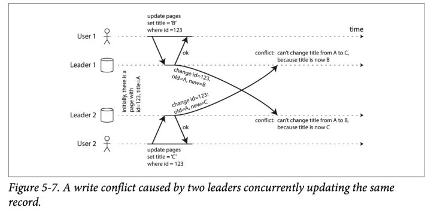
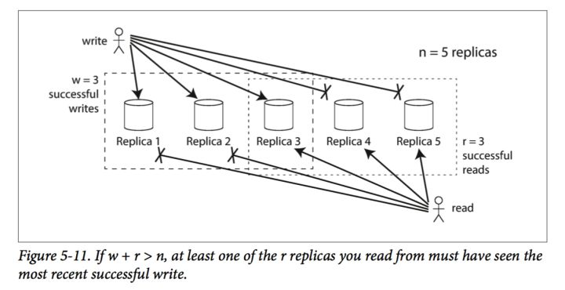

# 第五章 复制
https://zhuanlan.zhihu.com/p/36282816

### 读你所写（read you own writes）
几种策略：

*   任何由用户本人进行的修改，都从leader来读取修改，否则通过follower。这就意味着同时也需要在查询某些数据之前首先知道它是否被修改了。
*   如果一个应用可以被多个用户修改，那么这些数据都通过leader来读取，那么follower也起不到作用。这种情况下，就需要其他的措施，比如一分钟内的修改都通过leader，而其他时候的则通过follower。
*   客户端在进行读请求的时候，带上自己最后一次修改数据的时间戳，这样服务器根据这个来决定客户端的数据是否过时，但是依赖于这种本地时间的判断并不准确。
pic
还有一种情况，是一个数据可以由多个类型的app（pc、web等）来修改，这种情况成为跨设备的读你所写（cross device read -after-write）此时还有一些情况需要考虑：

*   知道用户何时修改数据变的很困难，因为这些数据可以被不同类型的设备修改，做这样的判断变的困难了。此时可以考虑把这种元数据（metadata）固定存放到同一个服务器（centralized）上的做法。

### 单调读（Monotonic Reads）
单调读指的是，某个用户如果读到一个数据，以后该用户的任何一次读取，都不会读到比该数据更早的数据。

解决单调读的通常做法是，某个用户的请求，都固定到特定的一个follower上。

### 一致性前缀读（Consistent Prefix Reads）

## 多leader复制

### 多leader复制的例子

#### 多数据中心

单leader和多leader的优缺点：

*   单leader的情况下，所有的写操作只能通过一个数据中心，加大了延迟。多leader的情况下，可以选择最近的数据中心进行写入。
*   可以承受某个数据中心宕机的情况。
*   单个 Leader 非常依赖集群内部网络的稳定性，而多 Leader 可以容忍暂时的网络问题，因为临时的网络问题不会影响整个系统的写入

#### 离线操作的客户端
另一个例子，是可以离线操作的客户端应用，这种应用即使在联不上网的情况仍然可以使用，而在联网之后会同步本地的修改到服务器。此时可以认为，本地的客户端和服务器分别就是不同的数据中心。

#### 多人协作编辑
如google doc之类的。

### 处理写冲突
多leader的最大问题是写冲突的问题，如图5-7所示，两个用户同时修改了页面内容。

以下是几种解决多leader情况下写冲突的策略：

#### 同步检测冲突

#### 避免冲突
某个记录固定只从某个leader写入，这样来避免写冲突。

这样做的问题在于，有时候需要修改某条记录的固定leader，比如该leader失效了，或者是该用户迁移到了另一个leader管辖的区域等等，此时这种策略就失效了。

#### 合并冲突
合并冲突的常用策略：

*   给每一次写一个全局唯一的ID（如时间戳、UUID、key的hash值等），选择ID最大的作为写操作的胜者。如果这里使用时间戳作为ID，就被称为“最后写入胜利（last write win，简称LWW）”，但是依赖于时间戳的算法都不安全，可能导致数据丢失。
*   给每一个备份一个独立的ID，让来自高ID备份的修改优先于低ID备份的修改，同样可能出现数据丢失的问题。
*   合并所有的写操作，使用字典序来排序并且合在一起。以5-7的例子而言，合并之后就是类似于"B\C"这样的数据。
*   由用户来解决冲突。

#### 定制写冲突解决逻辑
由于大部分情况下，写冲突都有用户来解决，所以提供了给使用者的写冲突解决策略：

### 何为冲突？
有些情况下，冲突是显而易见的，比如图5-7这样的。

但是有些情况下，冲突又不是一眼能看出来的。比如一个订会议室的系统，需要确保同一时间只被一个人订了，但是其实直到订位置的时候，才能直到是否订成功了。

## 无leader的复制
上面介绍的都是有leader存在情况下的复制，另外还有leader不存在也就是去中心化的复制。

### 当一个节点失效的情况下的更新
当一个node宕机时，在不存在leader的情况下，只需要集群中半数以上的节点还存活就能继续写入了。

而当宕机的node恢复时，如果客户端请求的数据正好是它宕机时产生的数据，那么读到的数据就是过时的。此时的策略是，客户端将并发向几个节点一起请求数据，然后再选择其中最新的数据。

### 读取时修复

*   客户端在并发向多个数据节点读数据时，能感知到哪个数据节点的数据是过时的，将在读的过程中也向这个节点同步最新的数据。
*   每个节点跑一个后台进程，通过该进程来进行数据的同步。

### 读写的quroms机制
在多个节点中读成功，或者写成功，才能认为是成功了。

假设有n个节点，只要其中有r个节点读成功就能认为读成功；w个节点写成功，就认为写成功。

一般而言，n都是奇数，而取r、w都为(n+1)/2，即过半数节点成功才行。而同时要至少保证w+r>n，这样才能保证至少一个节点能返回最新的数据。

### Quorums 机制的局限性

*   如果存在并行写入，那么集群无法知道写入的先后顺序，因为不存在 Leader。
*   如果写的同时还在读，那么无法保证读到的是新值还是旧值。
*   如果 w > r，那么可能发生写入成功的节点数不足 w，写入失败，而读的时候成功数大于 r，这样就读到了一个“写入失败”的值。

